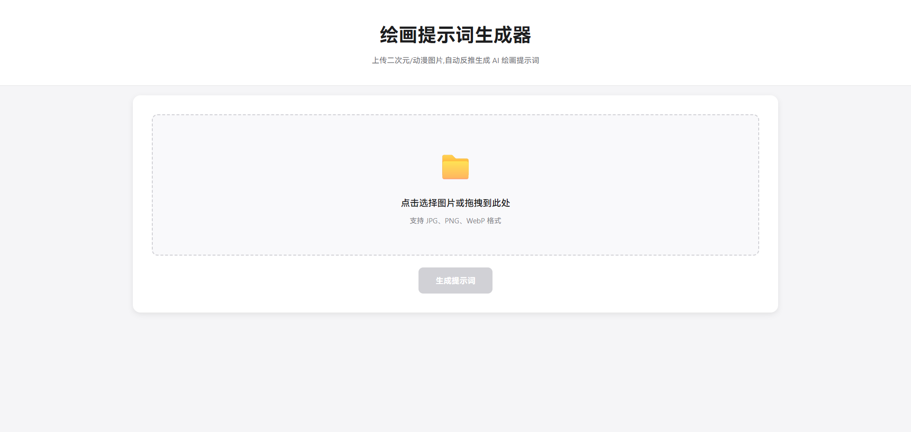
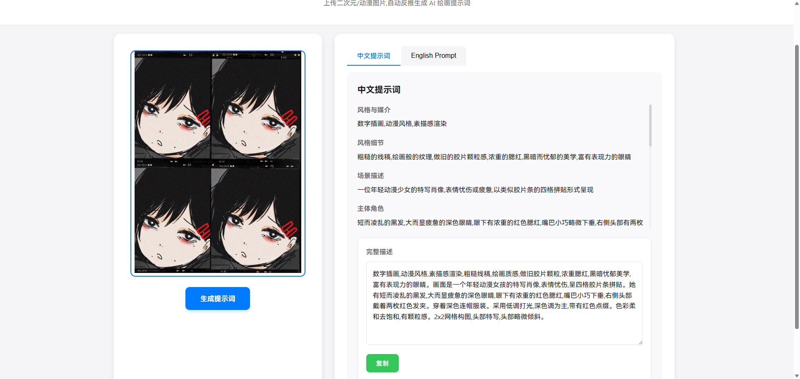
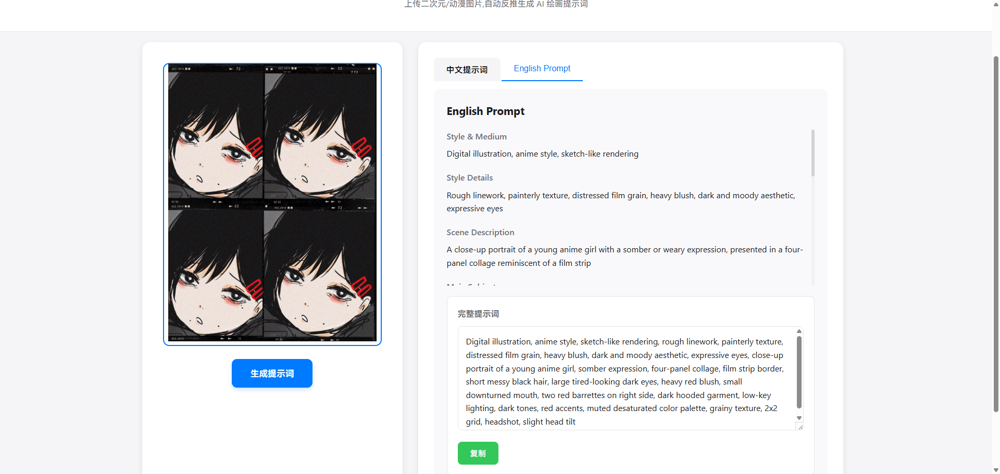

# Promptoon - AI绘画提示词生成器

Promptoon 是一个基于 Gemini AI 的绘画提示词生成工具，能够通过分析上传的二次元/动漫风格图片，自动生成详细的中英文 AI 绘画提示词。

## 功能说明

-  **图像上传分析** - 支持拖拽或点击上传 JPG/PNG/WebP 格式的图片
-  **AI智能识别** - 基于 Gemini 模型分析图片内容
-  **结构化提示词** - 自动生成包含风格、场景、主体、服装、背景等详细分类的提示词
-  **双语支持** - 同时提供中文和英文提示词，满足不同使用需求
-  **一键复制** - 可分别复制各字段内容或完整提示词
-  **响应式设计** - 适配桌面端和移动端浏览

### 提示词包含以下维度：

1. 风格与媒介 (Style & Medium)
2. 风格细节 (Style Details)
3. 场景描述 (Scene Description)
4. 主体角色 (Main Subject)
5. 服装道具 (Outfit & Props)
6. 背景 (Background)
7. 构图视角 (Composition & Perspective)
8. 光照色调 (Lighting & Color)
9. 特殊效果 (Special Effects)
10. 避免元素 (Avoid Elements)


## 文件结构

```
promptoon/
├── promptoon.py           # 主程序文件
├── requirements.txt       # Python依赖包列表
├── uploads/              # 上传图片存储目录
├── prompts/              # 提示词配置文件目录
│   ├── default_prompt.txt    # 提示词生成规则定义
│   └── default_dialogs.json  # 示例对话样本
├── templates/            # HTML模板目录
│   └── index.html        # 主页面模板
```

## 环境依赖

```
flask
flask-cors
pillow
requests
```

## 安装与部署

1. 克隆项目到本地：
```bash
git clone <repository-url>
cd promptoon
```

2. 安装依赖：
```bash
pip install -r requirements.txt
```

3. 配置环境变量：
```bash
export GEMINI_API_KEY="your_api_key_here"
export HTTP_PROXY="http://host:port" 
export HTTPS_PROXY="http://host:port"
```

4. 运行应用：
```bash
python promptoon.py
```

5. 浏览器访问：http://localhost:5000

## 界面截图

### 主界面 - 图片上传区域

*支持拖拽上传或点击选择图片文件*

### 生成结果 - 中文提示词展示

*结构化的中文提示词分类展示*

### 生成结果 - 英文提示词展示

*专业格式的英文提示词，可直接用于AI绘画工具*

## 使用说明

1. 打开浏览器访问应用地址
2. 点击上传区域选择图片，或直接拖拽图片到上传区域
3. 点击"生成提示词"按钮
4. 等待AI分析完成，在结果区域查看生成的提示词
5. 可切换中英文 Tab 查看不同语言的提示词


## 注意事项

- 上传图片建议大小不超过 3MB
- 支持 JPG/PNG/WebP 格式图片
- 应用需要网络连接以调用 Gemini API
- 如果使用代理，请确保代理服务器正常工作
